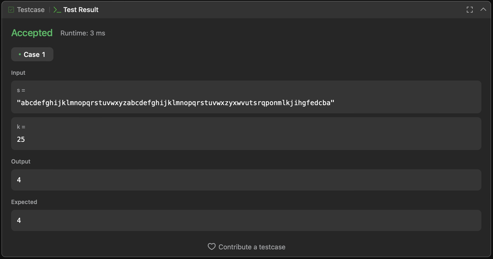

Counter-example to Leetcode [problem #3003](https://leetcode.com/problems/maximize-the-number-of-partitions-after-operations/), correct answer should be 3, but system expects 4.

```
s = 'abcdefghijklmnopqrstuvwxyzabcdefghijklmnopqrstuvwxzyxwvutsrqponmlkjihgfedcba'
k = 25
```

The idea of counter-example is based on the fact that in "Hint 3", authors don't take into consideration that replacement of i-th character may exstend the partition preceeding the partition where i resides.

Here is a bruteforce proof of the counter-example [partitions-counter-example-proof.py](partitions-counter-example-proof.py)

Output:
```
python3 partitions-counter-example-proof.py
i = 0, m = 3

abcdefghijklmnopqrstuvwxy zabcdefghijklmnopqrstuvwxz yxwvutsrqponmlkjihgfedcba
```

Screen from Leetcode:

